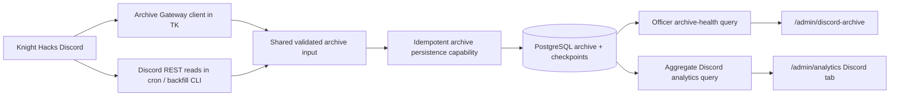

# Discord Message Archive SRD

Status: Approved

> This file owns technical implementation constraints.

## Technical purpose

Add a durable Discord ingestion capability that shares one normalization and
idempotent persistence contract across historical backfill, scheduled
reconciliation, and live Gateway capture. The stored corpus supports
officer-only operational health and bounded aggregate analytics without
exposing a raw-message read surface.

## Relevant principles

- [Sharing and package boundaries](../../../docs/agentic-development/forge-engineering-principles.md#sharing-and-package-boundaries)
- [tRPC and API principles](../../../docs/agentic-development/forge-engineering-principles.md#trpc-and-api-principles)
- [Database principles](../../../docs/agentic-development/forge-engineering-principles.md#database-principles)
- [Auth, Discord, and permission principles](../../../docs/agentic-development/forge-engineering-principles.md#auth-discord-and-permission-principles)
- [Testing principles](../../../docs/agentic-development/forge-engineering-principles.md#testing-principles)
- [Security and data hygiene](../../../docs/agentic-development/forge-engineering-principles.md#security-and-data-hygiene)
- [Blade design system](../../../apps/blade/DESIGN_SYSTEM.md)

## Access policy

- Discord ingestion clients may write archive state only for the configured
  Knight Hacks guild selected by the existing `NODE_ENV`-derived Discord
  constant.
- Direct messages and all other guilds are rejected before persistence.
- No tRPC procedure returns message content, embeds, components, attachment
  metadata, polls, or message-level search results.
- Archive-health page routing and `discordArchive.getHealth` require effective
  `IS_OFFICER`. A director title or another admin permission does not grant
  access.
- Discord aggregate analytics inherit the existing Club Analytics read policy.
  They return aggregate measures and channel labels, not messages, author
  identities, or relationship data.
- Client-side navigation hiding is not an access boundary. Page and procedure
  checks enforce the same policy server-side.
- Archive writes are automated operational writes, not human admin actions.
  They do not create one admin-audit event per Discord message.
- The first release exposes no dashboard mutation, raw-content export, or
  content-read procedure.

## Architecture / data flow

- `apps/tk` hosts a second Discord client authenticated with
  `DISCORD_ARCHIVE_BOT_TOKEN`. It has only `Guilds`, `GuildMessages`, and
  `MessageContent` intents and never registers commands.
- `apps/cron` owns Discord REST discovery and the one-minute reconciliation
  schedule. It uses the same Archive token.
- A resumable operator CLI owns exhaustive initial backfill. It reuses the
  cron discovery/fetch adapter and the shared persistence capability.
- `@forge/db` owns archive tables, indexes, relations, and migrations only.
- `@forge/validators` owns bounded protocol-independent archive input and query
  contracts.
- `@forge/api` owns idempotent archive persistence, checkpoint transitions,
  health reads, aggregate analytics, and authorization. It exposes a
  server-only archive capability for TK and cron so both clients use the same
  database semantics.
- Discord adapters convert REST/Gateway payloads into the shared validated
  input. `discord.js` objects do not cross into database schemas.
- Blade pages stay server-first. The health page checks `IS_OFFICER`, performs
  the initial server read, and renders a feature component. The Analytics
  workspace adds a Discord tab to its existing report/filter shell.
- Existing Postgres, TK, cron, Blade, and deployment units are reused. No new
  package is created unless implementation proves that `@forge/api` cannot
  expose a safe server-only capability without circular imports.

## Architecture decisions

### AD-001: Use PostgreSQL as the archive store

- Decision: Add normalized message/channel/checkpoint tables to the existing
  Postgres database.
- Alternatives considered:
  - A separate object-storage data lake adds infrastructure and weakens
    transactional checkpointing.
  - A new message broker improves outage buffering but adds a deployment unit
    that current club traffic does not justify.
- Consequence: SQL queries and idempotent transactions stay simple. Large
  future retrieval workloads may require derived indexes or separate storage,
  but this release does not preselect them.

### AD-002: Combine Gateway capture with REST reconciliation

- Decision: Treat Gateway events as the low-latency path and REST cursor
  traversal as the durable recovery path.
- Trade-off: REST creates background API traffic. It prevents Gateway downtime
  from creating permanent holes without introducing a queue.

### AD-003: Store current Discord state

- Decision: Upsert current content on create/update and purge content on
  delete. Do not retain edit revisions.
- Trade-off: Historical edit text is unavailable. Privacy and consistency with
  the current Discord state take priority.

### AD-004: Separate health from analytics

- Decision: Expose officer-only operational health at
  `/admin/discord-archive`; expose approved aggregates in the existing
  Analytics workspace.
- Trade-off: Two read contracts are required. Each contract remains narrow and
  follows the access policy of its audience.

### AD-005: Stage with optional runtime configuration

- Decision: The new Archive token is optional during rollout. Missing
  configuration disables archive clients with one safe operational notice.
- Trade-off: A deployment can run without ingestion. Health state must make
  the disabled condition obvious once the feature is enabled in Blade.

## Data model

### `discord_archive_channel`

One row per visible message-bearing channel or thread:

- Discord channel snowflake primary key stored as text;
- guild ID, parent channel ID, and channel type;
- current name and topic where available;
- thread flags including public/private, archived, and locked;
- discovery, Discord-update, and deletion timestamps; and
- safe bounded metadata required for traversal.

The table does not represent categories as message-bearing checkpoints, though
category identity may be stored as the parent of a normal channel.

### `discord_archive_message`

One row per Discord message snowflake:

- message ID primary key stored as text;
- guild and channel IDs;
- stable author Discord user ID plus current/snapshotted display fields;
- bot, webhook, application, and message-type indicators;
- current text content;
- created, edited, deleted, ingested, and last-observed timestamps;
- reply/reference identity, flags, pinned state, and mention summary;
- bounded JSON fields for embeds, attachments, components, stickers, and
  polls; and
- no unrestricted copy of the full Discord payload.

Discord snowflakes remain text across database, API, and UI boundaries. They
must never be coerced to JavaScript `number`.

Deleted rows retain message, guild, channel, author, creation, deletion, and
type fields needed for aggregate correctness. Content, embeds, components,
stickers, polls, mention payloads, and attachment metadata are set to empty or
null.

The archive stores only the stable Discord author ID for identity linkage.
Blade user/member resolution occurs through `User.discordUserId` at query or
derived-processing time. Mutable Discord usernames and
`Member.discordUser` are not join keys.

### `discord_archive_checkpoint`

One row per message-bearing channel/thread:

- channel ID primary key;
- guild ID;
- oldest successfully backfilled message ID;
- newest successfully observed message ID;
- next historical `before` cursor;
- backfill state and completion timestamp;
- last discovery and reconciliation timestamps;
- total messages processed;
- retry count and safe last-error code/message; and
- update timestamp.

Checkpoint writes occur in the same database transaction as the message page
they acknowledge. A failed page never advances its cursor.

### `discord_archive_state`

One row per configured guild records:

- feature state;
- last Gateway event and successful live write;
- last discovery start/success;
- last reconciliation start/success;
- last backfill progress;
- current safe error and failure count;
- a durable reconciliation lease owner/expiration; and
- timestamps used by the health page.

The worker uses a transaction-scoped PostgreSQL advisory lock to claim or
refresh this durable lease. External Discord calls do not run inside a
long-lived database transaction.

### Indexes

At minimum:

- `(guild_id, created_at desc, id desc)` on messages;
- `(channel_id, created_at desc, id desc)` on messages;
- `(author_discord_user_id, created_at desc)` on messages;
- partial or supporting indexes for non-deleted aggregate reads;
- `(guild_id, channel_type)` on channels; and
- checkpoint state/update indexes for health and backfill work selection.

No full-text or vector index is created because this release exposes no content
search or retrieval.

## Ingestion behavior

### Shared normalization and upsert

- REST and Gateway adapters produce the same validated archive message input.
- Create/backfill/reconciliation writes use `INSERT ... ON CONFLICT DO UPDATE`
  keyed by message ID.
- A repeated payload is idempotent.
- A newer complete observation replaces current content-bearing fields.
- A partial Gateway update never nulls fields that Discord omitted. The
  adapter fetches the complete message when allowed; otherwise persistence
  merges only fields explicitly present.
- An update received after a tombstone does not restore deleted content unless
  Discord REST confirms that the message currently exists.
- Live and historical paths may execute concurrently.

### Guild and DM boundary

- Every Gateway event must have a guild ID equal to
  `DISCORD.KNIGHTHACKS_GUILD`.
- REST discovery starts from only that configured guild.
- DM message objects and messages from any other guild fail closed before
  normalization/persistence.
- The Archive client does not request the `DirectMessages` intent.

### Discovery

- Enumerate visible guild channels.
- Create checkpoints only for text, announcement, forum/media post, public
  thread, and already-visible private thread types.
- Enumerate all active threads the bot can view.
- Paginate archived public threads for each eligible parent.
- Paginate archived private threads joined by the Archive bot.
- Do not request `MANAGE_THREADS` and do not attempt to discover inaccessible
  private threads.
- Upsert current channel/thread metadata and mark previously known channels
  deleted only when Discord confirms their removal.
- A missing permission records a safe coverage error without exposing the bot
  token or halting unrelated channels.

### Historical backfill

- A new checkpoint begins from the newest available page and records both the
  newest observed ID and the next backward cursor.
- Pages contain at most Discord's allowed limit and advance toward older
  messages using `before`.
- The initial operator command loops until all eligible checkpoints complete,
  subject to graceful cancellation and Discord rate limits.
- The scheduled worker may continue bounded backfill work after
  reconciliation so interrupted initial backfills heal automatically.
- Cursor state persists after every committed page.
- Restarting the command resumes incomplete checkpoints.

### Reconciliation

- Run every minute.
- Rediscover channel/thread topology on a less frequent bounded cadence within
  the worker, with an immediate discovery on missing/stale state.
- For each known channel, compare recent REST history to the newest committed
  cursor.
- Reconciliation starts from the newest REST page and walks backward until it
  overlaps the committed cursor. This avoids skipping messages when more than
  one page arrived during downtime.
- Sort and upsert the recovered set deterministically, then advance the newest
  cursor in the same transaction.
- Bound concurrency and let the official Discord REST client honor route and
  global rate limits.
- One failed channel does not discard progress from successful channels.

### Live Gateway capture

- Handle `messageCreate`, `messageUpdate`, `messageDelete`, and
  `messageDeleteBulk`.
- Handle channel/thread create, update, and delete metadata events needed to
  keep coverage current.
- Successful live writes update guild health and the channel's newest cursor.
- A write failure is logged without message content and leaves reconciliation
  responsible for recovery.
- Listener errors must not terminate the existing TK command client.
- No reaction events are registered.

## tRPC/API behavior

### Server-only ingestion capability

Provide validated functions for:

- upserting channel metadata;
- upserting one message or a committed message page;
- applying one or many tombstones;
- committing historical/reconciliation checkpoints;
- claiming/releasing worker state; and
- purging content-bearing fields by Discord author ID for approved deletion
  requests.

These functions are not public web procedures.

### `discordArchive.getHealth`

- Type: `permProcedure.query`.
- Access: explicit effective `IS_OFFICER`.
- Input: bounded optional channel-state pagination/filter input.
- Output:
  - guild-level live/discovery/reconciliation/backfill health;
  - aggregate stored counts;
  - per-channel/thread coverage and checkpoint state;
  - safe recent ingestion metadata; and
  - safe errors with no secrets or message content.

### Discord Analytics report

- Extend the Analytics capability with a named Discord report/query that
  accepts the existing reporting-period filter contract.
- Access: existing Club Analytics access helper.
- Output:
  - selected-period message count;
  - calendar-day average and active-day count;
  - unique-author count;
  - visible channel/thread counts;
  - time-series buckets following existing Analytics grain rules where
    practical; and
  - channel distribution with counts and shares.
- Exclude tombstoned messages from content-derived counts but retain an
  explicit deleted-message count when useful for reconciliation transparency.
- Return no message IDs, message content, author IDs/names, reply targets,
  embeds, attachments, or per-author rankings.

## Validation

- `@forge/validators` defines bounded enums and schemas for normalized message,
  channel, checkpoint, health pagination, and Discord analytics inputs.
- JSON metadata fields use explicit projections and size/count limits. The
  system never accepts an arbitrary raw Discord payload.
- Snowflake validation accepts Discord text IDs without numeric conversion.
- Guild IDs are server-derived. Neither Blade clients nor tRPC callers choose
  an ingestion guild.
- Error persistence strips tokens, authorization headers, message content, and
  unrestricted Discord response bodies.

## Data / migration / compatibility

- Add one generated Drizzle migration for the archive schema and indexes.
- Migration is additive and has no historical data transform.
- Archive history begins empty in each database; the backfill command populates
  it after migration.
- Existing TK, cron, and Blade behavior must continue when
  `DISCORD_ARCHIVE_BOT_TOKEN` is absent during staged rollout.
- Add the new token to `.env.example`, Turbo environment declarations, TK env
  validation, and cron env validation. Never commit a token.
- Keep archive tables out of `packages/db/scripts/seed_devdb.ts` allowlists.
  Sanitized production snapshots therefore truncate/archive no message data.
- Document compatibility with current production `main`: the additive tables,
  optional env, and dormant clients do not change existing command, cron, or
  Blade behavior until configured.
- Rollback disables the Archive token/client and cron registration first. The
  additive tables remain until an explicit reviewed data-retention decision;
  migration rollback must not silently destroy captured content.
- Production enablement requires confirmation that primary storage and backups
  encrypt data at rest.

## Discord integration

- Use the dedicated Archive application/token for both Gateway and REST.
- Enable `MESSAGE_CONTENT` in the Discord Developer Portal and request
  `Guilds`, `GuildMessages`, and `MessageContent` in code.
- The bot requires `VIEW_CHANNEL` and `READ_MESSAGE_HISTORY`.
- The bot does not require Administrator, message-send permissions,
  `MANAGE_MESSAGES`, or `MANAGE_THREADS`.
- Discord REST is the recovery source for messages that still exist.
  Discord-deleted history cannot be reconstructed after deletion.
- Edits converge to current Discord state. Deletes purge stored
  content-bearing fields.
- Bot, webhook, application, and system messages remain distinguishable for
  aggregate filtering.

## Configurability review

Would this require a developer change next year?

- Answer: Routine channel additions, thread creation, history growth, and bot
  downtime require no developer change. Discovery derives topology from the
  configured guild and persisted checkpoints.
- The guild continues to use the repository's existing environment-specific
  Knight Hacks constant by explicit product decision.
- The reconciliation cadence is code-owned operational configuration in v1.
  If officers later need to tune cadence, retention, or channel exclusions,
  move those settings into a domain-specific admin configuration table.
- New derived products require reviewed API/UI work. They must not gain raw
  corpus access by convention.

## React / frontend constraints

- Read `apps/blade/DESIGN_SYSTEM.md` and
  `docs/agentic-development/frontend-design-skill.md` before implementation.
- `/admin/discord-archive/page.tsx` stays server-side and enforces
  `IS_OFFICER` before querying.
- Use the shared admin page header, spacing, card, skeleton, empty, and error
  patterns established by Companies/Members and the current Analytics page.
- Use a unique normal-case eyebrow and Lucide icon. Proposed copy:
  `Discord operations` and `Discord archive health`.
- Add navigation in the existing alphabetized configured-admin section.
- The Analytics Discord tab reuses the existing responsive tab/filter shell,
  charts, tables, and server-provided report state.
- Client components receive bounded DTOs. They never receive raw message
  objects.
- Health timestamps identify stale/degraded state with text and iconography,
  not color alone.

## Testing / verification strategy

- Write tests from `test-cases.md` before implementation where practical.
- `packages/validators`: normalized input and query validation tests.
- `packages/api`: archive transaction, idempotency, checkpoint, access, purge,
  health, and aggregate analytics tests.
- `apps/cron`: discovery, pagination, reconciliation, rate-limit/failure, and
  lease coordination tests using Discord REST fixtures.
- `apps/tk`: Gateway filter, partial update, tombstone, and listener-isolation
  tests.
- `apps/blade`: health/dashboard and Analytics Discord-tab render tests.
- Selected Playwright coverage verifies officer/non-officer routing and the
  dashboard/tab states if the seeded harness can represent archive fixtures.
- Generate and apply the migration against a fresh database and the available
  sanitized upgrade fixture.
- Narrow checks precede `pnpm verify:precommit` and `pnpm verify:push`.
- Run `pnpm analyze:react:changed` before committing meaningful React changes.

## Rollout

1. Apply schema migration with Archive clients disabled.
2. Enable the Archive token in development TK and cron.
3. Run discovery plus a bounded historical page; verify rows and checkpoints.
4. Interrupt and resume the backfill to prove durability.
5. Enable live capture and ask the human to send create/edit/delete test
   messages in the development guild.
6. Confirm reconciliation repairs an intentionally missed message.
7. Verify health and Analytics surfaces with development data.
8. Confirm production database and backup encryption at rest.
9. Deploy dormant production code, enable the production token, and start live
   capture before production historical backfill.
10. Monitor health, then run/resume the full production backfill.

## Open questions

None. Technical decisions were approved on 2026-07-26.
