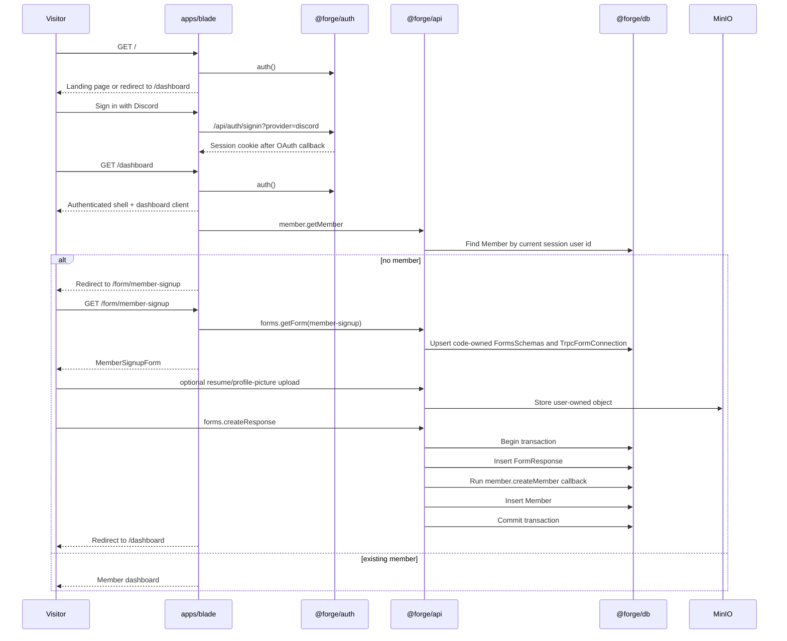

# Initial Member Onboarding Architecture Review

Status: Ready for human code review

This document explains the current feature diff at an architectural level. It is meant to help reviewers understand where behavior lives, why files were placed where they are, and which paths deserve the closest review.

## Executive Summary

This diff adds the first Blade Reforge member flow:

1. Public landing page.
2. Discord sign-in.
3. Authenticated member signup at `/form/member-signup`.
4. Generic form response creation with a server-side `member.createMember` callback.
5. Member dashboard at `/dashboard`.
6. Resume and profile-picture upload through MinIO.
7. Repo-level frontend design guidance for future agent/provider work.

The feature intentionally avoids new database tables and migrations. It reuses existing `User`, `Member`, `FormsSchemas`, `FormResponse`, and `TrpcFormConnection` shapes. Guild-facing profile fields still live on `Member` for now.

## Recommended Review Order

1. `packages/validators/src/member.ts`
   - Confirms the member form shape, Code of Conduct requirement, Guild fields, callback mapping, and JSON schema generation.

2. `packages/api/src/utils/forms/manager.ts`
   - Confirms generic form response behavior, transactional callback execution, permission checks, resubmission checks, and JSON-schema validation.

3. `packages/api/src/utils/member/onboarding.ts` and `packages/api/src/utils/member/profile.ts`
   - Confirms the member signup form registration and the shared member creation write path.

4. `packages/api/src/utils/resume/*` and `packages/api/src/utils/profile-picture/*`
   - Confirms upload validation, object naming, ownership checks, and signed URL behavior.

5. `apps/blade/src/app/form/[slug]/page.tsx`, `apps/blade/src/app/dashboard/page.tsx`, and `apps/blade/src/hooks/use-member.ts`
   - Confirms authenticated routing, dashboard/member branching, and reusable member state handling.

6. `apps/blade/src/app/_components/member/*`
   - Confirms form rendering, upload UI, dashboard layout, skeleton behavior, and user feedback states.

7. `.forge/features/initial-member-onboarding/*`
   - Confirms spec/SRD/test/status artifacts match the implemented behavior.

## High-Level Runtime Flow

## Package Boundaries

### `@forge/validators`

Owns reusable validation and code-owned form metadata.

Files:

- `packages/validators/src/forms.ts`
  - Generic helper validators for required text, optional text, optional URL, storage object names, date strings, option membership, and empty-string-to-null conversion.
  - Kept member-agnostic so later feature validators can reuse these helpers.

- `packages/validators/src/member.ts`
  - Member signup constants:
    - `MEMBER_SIGNUP_FORM_ID`
    - `MEMBER_SIGNUP_CONNECTION_ID`
    - `MEMBER_SIGNUP_FORM_SLUG`
    - `MEMBER_SIGNUP_CALLBACK_PROC`
    - `MEMBER_SIGNUP_COMPLETION_REDIRECT_URL`
    - `MEMBER_CODE_OF_CONDUCT_URL`
  - `memberFormSchema` validates raw form values, including required Code of Conduct acceptance.
  - `memberSchema` transforms raw form values into the API/database-oriented member input.
  - `GuildProfile` is a type-level grouping for Guild-facing data, but persistence still stays on `Member`.
  - `memberSignupFields` defines the code-owned signup field list for rendering.
  - `memberSignupFormData` maps fields into the legacy `FORMS.FormType` shape.
  - `memberSignupCallbackConnections` maps form field names to callback input field names.
  - `memberSignupFormJsonSchema` gives the forms manager a JSON-schema validation source.
  - `memberSignupFormDefinition` is the Blade-facing form definition.

- `packages/validators/src/member.test.ts`
  - Focused tests for the member validator, including Code of Conduct acceptance.

- `packages/validators/src/index.ts`
  - Exports `forms` and `member` validators.

Package changes:

- `packages/validators/package.json`
  - Adds `@forge/consts` because member validators reuse existing Forge option constants.

### `@forge/api`

Owns session-aware server behavior, tRPC routers, generic form response submission, member creation, and upload/storage workflows.

#### Router Surface

- `packages/api/src/root.ts`
  - Registers:
    - `auth`
    - `forms`
    - `member`
    - `profilePicture`
    - `resume`
    - `health`

- `packages/api/src/routers/auth.ts`
  - Public session/liveness router.
  - `auth.getSession` returns a safe session projection.

- `packages/api/src/routers/forms.ts`
  - Thin router that delegates to the generic forms manager.
  - `forms.getForm` loads a form by slug and prepares code-owned forms when needed.
  - `forms.createResponse` validates and stores a response, then runs configured callbacks.

- `packages/api/src/routers/member.ts`
  - `member.getMember` returns the current user's member profile or `null`.
  - `member.createMember` validates input with `memberSchema` and calls the shared member write utility.

- `packages/api/src/routers/resume.ts`
  - `resume.uploadResume` validates/stores a PDF in MinIO and returns an object name.
  - `resume.saveMemberResume` persists or clears the current member's resume object name.
  - `resume.getResume` returns a temporary signed URL for the current user's saved resume.

- `packages/api/src/routers/profile-picture.ts`
  - `profilePicture.uploadProfilePicture` validates/stores an image in MinIO and returns an object name.
  - `profilePicture.saveMemberProfilePicture` persists or clears the current member's profile-picture object name.
  - `profilePicture.getProfilePicture` returns a temporary signed URL for the current user's saved image.

#### Generic Forms Runtime

- `packages/api/src/utils/forms/manager.ts`
  - Defines `CodeOwnedFormConfig`.
  - Upserts code-owned `FormsSchemas` and `TrpcFormConnection` rows.
  - Validates responses by converting form JSON schema to zod through `json-schema-to-zod`.
  - Enforces closed-form, response-role, and resubmission rules.
  - Persists `FormResponse`.
  - Maps `TrpcFormConnection.connections` fields to callback input.
  - Runs server-owned callbacks from a callback map.
  - Runs response persistence and callbacks in one `db.transaction`.

Why this lives in `utils/forms`:

- The manager is intentionally form-generic.
- It has no member-specific imports.
- Member-specific wiring is supplied through config and callback maps.

- `packages/api/src/utils/forms/config.ts`
  - Registers code-owned forms and callback functions.
  - Currently includes only the member signup form and `member.createMember` callback.

#### Member Write Path

- `packages/api/src/utils/member/onboarding.ts`
  - Converts validator-owned member form metadata into `CodeOwnedFormConfig`.
  - Exposes `createMemberFromFormResponse`, the callback used by `forms.createResponse`.

- `packages/api/src/utils/member/profile.ts`
  - Shared member creation write path used by both `member.createMember` and the form callback.
  - Checks for an existing member by `session.user.id`.
  - Derives `userId`, Discord display value, and age server-side.
  - Normalizes optional fields.
  - Normalizes profile-picture and resume object names before persistence.
  - Translates unique-constraint errors into safe user-facing conflict messages.

Why this is a utility:

- The write path is shared by a direct tRPC procedure and a forms callback.
- It accepts `WriteDb`, so it can run with either the normal DB client or a transaction handle.

#### Upload and Storage Utilities

- `packages/api/src/utils/resume/security.ts`
  - PDF data URL validation.
  - Max-size checks.
  - PDF magic-byte check.
  - Server-generated object naming.
  - User ownership checks for object names.

- `packages/api/src/utils/resume/storage.ts`
  - MinIO bucket creation.
  - Resume upload.
  - Resume object-name normalization for persistence.
  - Current-member resume update/clear.
  - Temporary signed URL generation.
  - Best-effort unreferenced object cleanup helper.

- `packages/api/src/utils/profile-picture/security.ts`
  - Image data URL validation for JPEG, PNG, GIF, and WebP.
  - Max-size checks.
  - Image magic-byte checks.
  - Server-generated object naming.
  - User ownership checks.

- `packages/api/src/utils/profile-picture/storage.ts`
  - MinIO bucket creation.
  - Profile-picture upload.
  - Profile-picture object-name normalization for persistence.
  - Current-member profile-picture update/clear.
  - Temporary signed URL generation.

Persistence note:

- Existing columns `Member.resumeUrl` and `Member.profilePictureUrl` are reused.
- Despite the `Url` names, this slice stores MinIO object names, not public URLs.
- Temporary public access is provided only through signed URL queries.

#### API Infrastructure

- `packages/api/src/trpc.ts`
  - Creates tRPC context with session and request headers.
  - Defines `protectedProcedure`.
  - Adds zod flattening to tRPC errors.

- `packages/api/src/utils/db.ts`
  - Defines `WriteDb` as either the regular DB client or a transaction handle.
  - Used by shared utilities that need to participate in transactions.

- `packages/api/src/env.ts`
  - Adds MinIO env requirements:
    - `MINIO_ENDPOINT`
    - `MINIO_ACCESS_KEY`
    - `MINIO_SECRET_KEY`

- `packages/api/src/minio/minio-client.ts`
  - Keeps a shared MinIO client export for package consumers.

- `packages/api/src/utils.ts`
  - Removed in favor of the `packages/api/src/utils/index.ts` folder entrypoint.

Package changes:

- `packages/api/package.json`
  - Adds `@forge/consts`, `@forge/validators`, and `json-schema-to-zod`.
  - Exports `./utils` from `src/utils/index.ts`.

### `apps/blade`

Owns routing, pages, tRPC client setup, authenticated shell, form UI, dashboard UI, and user-facing feedback.

#### App Shell and Providers

- `apps/blade/src/app/layout.tsx`
  - Uses dark mode by default.
  - Adds metadata from `NEXT_PUBLIC_BLADE_URL`.
  - Wraps the app in `Providers`.

- `apps/blade/src/app/_components/providers.tsx`
  - Mounts the Forge UI theme provider.
  - Mounts the tRPC React Query provider.
  - Mounts the toast provider.

- `apps/blade/src/app/globals.css`
  - Defines Blade color tokens and base dark theme.
  - Adds the grid/moving-border styles used by the landing page.

- `apps/blade/public/*`
  - Adds Knight Hacks and Tech Knight assets used by the landing page and shell.

#### Public Auth Entry

- `apps/blade/src/app/page.tsx`
  - Server component.
  - Calls `auth()`.
  - Redirects authenticated users to `/dashboard`.
  - Renders the public landing page for unauthenticated users.

- `apps/blade/src/app/_components/auth/discord-sign-in-link.tsx`
  - Renders a plain anchor to `/api/auth/signin?provider=discord&callbackURL=/dashboard`.
  - Uses a plain anchor rather than Next Link so OAuth starts as browser navigation.

- `apps/blade/src/app/api/auth/signin/route.ts`
  - Re-exports `signInRoute` from `@forge/auth/server`.

- `apps/blade/src/app/api/auth/[...all]/route.ts`
  - Re-exports Better Auth handlers.

- `apps/blade/src/app/_components/auth/sign-out-button.tsx`
  - Client component using `authClient.signOut()`.
  - Navigates back to `/` and refreshes.

#### tRPC Setup

- `apps/blade/src/app/api/trpc/[trpc]/route.ts`
  - Next route handler for tRPC.
  - Creates API context with the current auth session.
  - Adds CORS headers.
  - Adds a request-size guard.

- `apps/blade/src/trpc/query-client.ts`
  - Shared React Query client configuration.
  - Uses SuperJSON for hydrate/dehydrate.

- `apps/blade/src/trpc/react.tsx`
  - Client-side tRPC provider and API hooks.

- `apps/blade/src/trpc/server.ts`
  - RSC caller and hydration helpers.
  - Injects current auth session into tRPC context.

- `apps/blade/src/env.ts`
  - Blade env composition.
  - Extends auth, API, and DB env.
  - Defines `NEXT_PUBLIC_BLADE_URL` and `PORT`.

#### Authenticated Member Flow

- `apps/blade/src/app/_components/member/authenticated-shell.tsx`
  - Shared shell for authenticated pages.
  - Renders sticky header, Knight Hacks logo, current Discord/session display, and sign-out.

- `apps/blade/src/app/dashboard/page.tsx`
  - Server component.
  - Requires `auth()`.
  - Renders `AuthenticatedShell`.
  - Delegates member data branching to `DashboardClient`.

- `apps/blade/src/hooks/use-member.ts`
  - Reusable client hook for current-member state.
  - Calls `api.member.getMember`.
  - Handles unauthenticated redirect.
  - Optionally redirects authenticated users without a member profile to onboarding.
  - Returns stable state flags for dashboard and future member surfaces.

- `apps/blade/src/app/_components/member/dashboard-client.tsx`
  - Uses `useMember({ redirectNoMemberTo: "/form/member-signup" })`.
  - Shows dashboard-shaped skeleton while loading or redirecting.
  - Shows a safe generic error state.
  - Renders `MemberDashboard` once member data exists.

- `apps/blade/src/app/_components/member/member-dashboard.tsx`
  - Presentational dashboard.
  - Left panel: member account/profile summary, academics, resume controls.
  - Right panel: Guild-style social profile card.
  - No dashboard entrance animation. Loaded content replaces skeleton immediately.
  - Uses stable top-level panel and nested surface classes.

#### Form Route and Signup UI

- `apps/blade/src/app/form/[slug]/page.tsx`
  - Server component.
  - Requires `auth()`.
  - Currently supports only `member-signup`.
  - Calls `forms.getForm` to prepare/load the code-owned form.
  - Redirects existing members to the form completion URL.
  - Renders `MemberSignupForm` inside `AuthenticatedShell`.

- `apps/blade/src/app/_components/member/member-signup-form.tsx`
  - Client component.
  - Renders fields from `memberSignupFormDefinition`.
  - Uses the generic form response path, not a bespoke member-only submit endpoint.
  - Uploads profile picture and resume before final form submission when selected.
  - Submits through `forms.createResponse`.
  - Redirects to the form completion URL after successful response/callback completion.
  - Includes required Code of Conduct checkbox linked to the Knight Hacks Code of Conduct.
  - Explains Guild visibility semantics.

- `apps/blade/src/hooks/use-object-preview-url.ts`
  - Small hook for local object URL previews.
  - Revokes previous object URLs on replacement and cleanup.

#### Upload UI Components

- `apps/blade/src/app/_components/member/member-resume-upload.tsx`
  - Upload/replace/remove current member resume.
  - Opens resume preview in a dialog.
  - Uses signed URL query only when the user opens the viewer.
  - Uses local object URL preview for newly selected files.

- `apps/blade/src/app/_components/member/resume-preview.tsx`
  - Shared PDF preview component.

- `apps/blade/src/app/_components/member/member-profile-picture-upload.tsx`
  - Upload/replace/remove current member profile picture.
  - Renders a circular avatar.
  - Uses an upload icon on the bottom-right of the avatar.
  - Uses a destructive icon-only remove action on the bottom-left.
  - Falls back to initials when no saved/preview image exists.
  - Ignores cached signed URLs after the profile picture object name is cleared.

### Feature Artifacts

Files:

- `.forge/features/initial-member-onboarding/spec.md`
- `.forge/features/initial-member-onboarding/srd.md`
- `.forge/features/initial-member-onboarding/test-cases.md`
- `.forge/features/initial-member-onboarding/status.md`
- `.forge/features/initial-member-onboarding/architecture-review.md`

Purpose:

- `spec.md` owns product behavior.
- `srd.md` owns technical design and constraints.
- `test-cases.md` owns observable behavior cases.
- `status.md` records decisions, progress, checks, and caveats.
- This file gives reviewers a diff map.

### Agent and Design Guidance

Files:

- `apps/blade/DESIGN_SYSTEM.md`
- `AGENTS.md`
- `docs/agentic-development/frontend-design-skill.md`
- `docs/agentic-development/forge-engineering-principles.md`
- `.claude/skills/frontend-design/SKILL.md`
- `.cursor/rules/frontend-design.mdc`

Purpose:

- Adds the Blade design-system source of truth for tokens, surfaces, typography, spacing, components, dashboard hierarchy, and contribution rules.
- Adds repo-wide frontend design guidance for Codex, Claude, and Cursor.
- Encodes the Blade dashboard surface hierarchy:
  - Top-level panels use a lighter raised `bg-card` treatment.
  - Nested dashboard tiles/link rows use a darker inset surface.
- Adds guidance on naming, comments, colocating business logic, and extracting utilities only when behavior is shared.

## Data and Transaction Boundaries

### Member Signup Form

The member signup form is code-owned but persisted/upserted into existing form tables at runtime:

- Form record: `FormsSchemas`
- Callback connection: `TrpcFormConnection`
- Response record: `FormResponse`

The code-owned form config lives in:

- `packages/api/src/utils/member/onboarding.ts`

The validator-owned form definition lives in:

- `packages/validators/src/member.ts`

### Form Response Transaction

`forms.createResponse` runs the critical signup path in one transaction:

1. Prepare/load the form.
2. Check closed state.
3. Check response-role permissions.
4. Check resubmission rules.
5. Validate response data.
6. Insert `FormResponse`.
7. Load configured `TrpcFormConnection` rows.
8. Map response fields to callback input.
9. Invoke registered server callbacks.
10. Commit.

If `member.createMember` fails, the inserted `FormResponse` rolls back.

### Member Creation

The API never trusts client-owned identity fields for member creation:

- `userId` comes from `ctx.session.user.id`.
- `discordUser` comes from `ctx.session.user.name`.
- `age` is calculated server-side from date of birth.
- Resume/profile-picture values are normalized to current-user-owned MinIO object names.

### Upload Persistence

The upload flow is intentionally split:

1. Client validates selected file enough for quick feedback.
2. Client sends data URL to upload mutation.
3. API validates bytes and content.
4. API stores object in MinIO with a server-generated user-owned path.
5. API returns object name, not a URL.
6. Signup form submits object name as part of form response.
7. Member callback persists object name onto `Member`.

For existing members, upload and persistence are two API calls:

1. `uploadResume` or `uploadProfilePicture`.
2. `saveMemberResume` or `saveMemberProfilePicture`.

## Security and Ownership Notes

Auth:

- Public landing page can be reached without a session.
- `/dashboard` and `/form/member-signup` call `auth()` server-side.
- tRPC protected procedures reject missing sessions.

Form callbacks:

- Clients cannot submit arbitrary callback procedure names.
- Callback names come from server-owned form config and DB `TrpcFormConnection` rows.
- Runtime callback execution uses a server callback map.

Uploads:

- Resume upload requires PDF data URL, valid base64, size bounds, and `%PDF-` magic bytes.
- Profile picture upload requires supported image data URL, valid base64, size bounds, and matching magic bytes.
- Object names are generated under the current user's prefix.
- Save and signed URL paths check object ownership before persisting or returning a URL.

Signed URLs:

- Resume/profile-picture previews use temporary MinIO signed URLs.
- The dashboard fetches saved resume URLs only when the user opens the viewer.

## Important Review Items and Caveats

1. tRPC body limit vs resume size
   - `apps/blade/src/app/api/trpc/[trpc]/route.ts` rejects requests over 4,194,304 bytes.
   - Resume validation allows 5MB PDFs, and base64 encoding is larger than the raw file.
   - Effective upload size may be lower than the UI/API copy claims.
   - Reviewers should decide whether to raise the route limit, lower the resume limit, or move uploads to presigned direct-to-MinIO flows.

2. `json-schema-to-zod` uses dynamic code generation
   - `packages/api/src/utils/forms/manager.ts` converts JSON schema to zod with `new Function`.
   - The comment states the schema is generated by Forge or code-owned feature config.
   - This is acceptable only if form schema authorship remains trusted or is sandboxed later.

3. `Member.userId` is not made DB-unique in this slice
   - The API checks for an existing member before insert.
   - A future DB hardening slice should consider a unique constraint if production data allows it.

4. Upload orphans are possible
   - Signup uploads happen before final form submission.
   - If a user uploads a file and never submits, an unreferenced MinIO object can remain.
   - Resume storage has a best-effort cleanup utility, but this slice does not schedule cleanup.
   - Profile-picture storage does not currently include the same cleanup helper.

5. Existing column names say `Url`
   - `Member.resumeUrl` and `Member.profilePictureUrl` store object names in this slice.
   - This is compatible with no-migration reuse, but reviewers should confirm the naming tradeoff is acceptable.

6. Dashboard member branching is client-side after session guard
   - `/dashboard` performs the auth guard server-side.
   - Member profile loading and no-member redirect happen through `useMember`.
   - This is intentional so `useMember` can be reused, but it means the dashboard skeleton appears while member state loads.

7. Signup form still has section reveal motion
   - Dashboard entrance animations were removed because skeleton replacement looked glitchy.
   - Signup form section reveal remains, because it is not part of the skeleton-to-loaded dashboard swap.

## Validation Recorded for This Feature

The feature status file contains the full command history. The latest relevant checks include:

- `npm exec --yes pnpm@9.12.1 -- --filter=@forge/validators lint`
- `npm exec --yes pnpm@9.12.1 -- --filter=@forge/validators typecheck`
- `npm exec --yes pnpm@9.12.1 -- --filter=@forge/validators test`
- `npm exec --yes pnpm@9.12.1 -- --filter=@forge/api lint`
- `npm exec --yes pnpm@9.12.1 -- --filter=@forge/api typecheck`
- `npm exec --yes pnpm@9.12.1 -- --filter=@forge/blade lint`
- `npm exec --yes pnpm@9.12.1 -- --filter=@forge/blade typecheck`
- `npm exec --yes pnpm@9.12.1 -- analyze:react apps/blade/src/app`
- `git diff --check`
- Local unauthenticated `/dashboard` smoke check returns the expected `307` redirect to `/`.

Known validation limitation:

- `analyze:react:changed` was blocked by an analyzer failure in legacy Blade while comparing against `origin/main`.

## Reviewer Checklist

Use this checklist for a human code review:

- Confirm the member fields in `memberSignupFields` match the existing DB-backed `Member` model and the desired first-slice product scope.
- Confirm Code of Conduct acceptance should be validated but not persisted on `Member`.
- Confirm Guild fields should remain on `Member` for this slice.
- Confirm the code-owned form upsert strategy is acceptable until admin form management exists.
- Confirm response persistence and member creation should share one transaction.
- Confirm the body-size caveat for uploads is acceptable or should be fixed before merge.
- Confirm the MinIO object-name-in-`Url`-column compromise is acceptable for no-migration reuse.
- Confirm dashboard member branching through `useMember` is acceptable.
- Confirm the frontend design guidance belongs repo-wide and should apply to Claude/Codex/Cursor.
