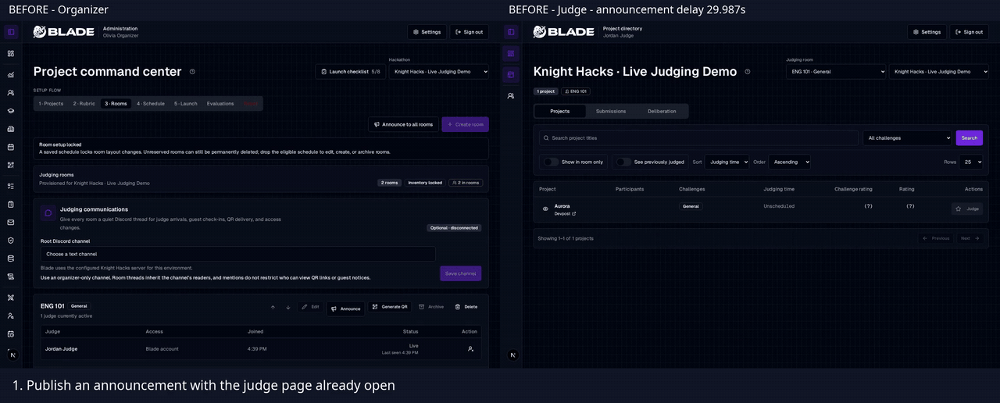
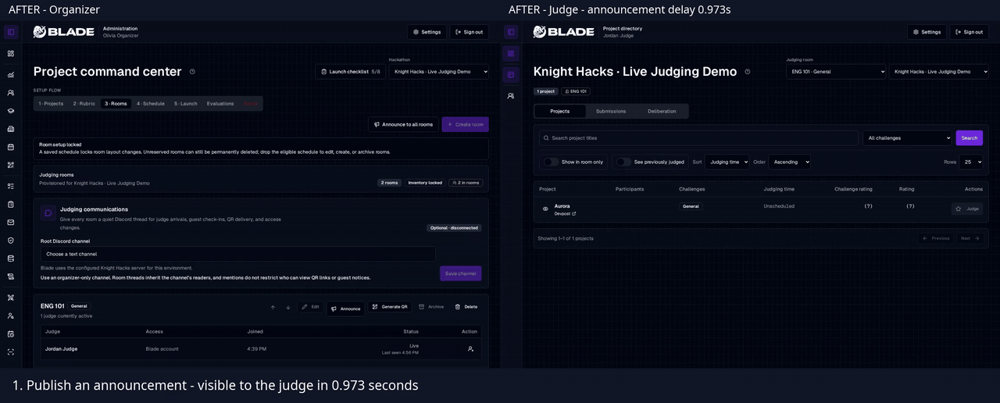
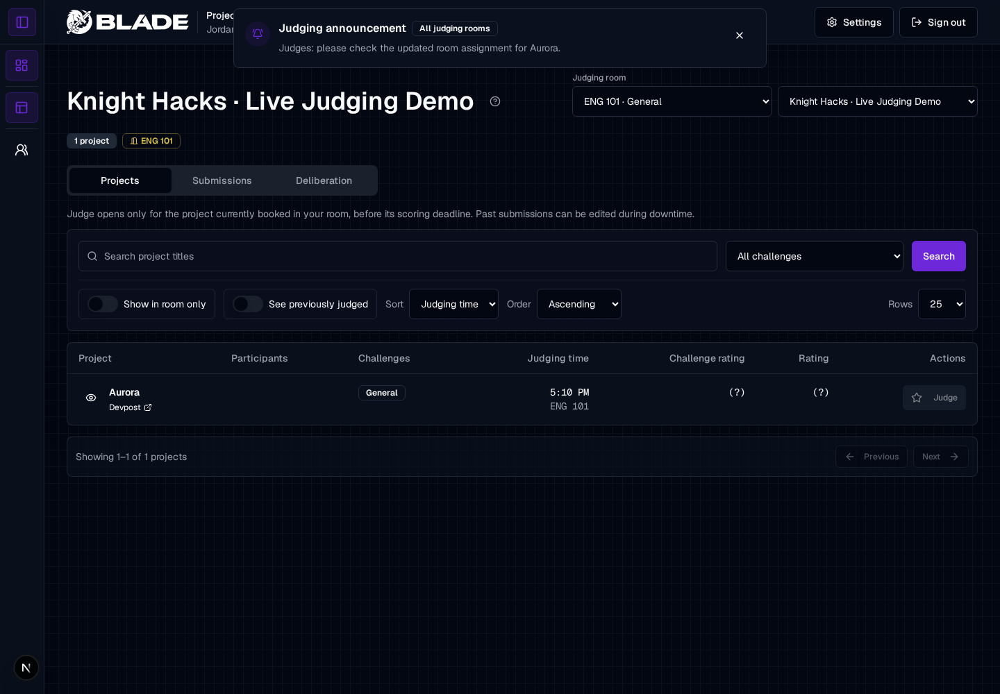
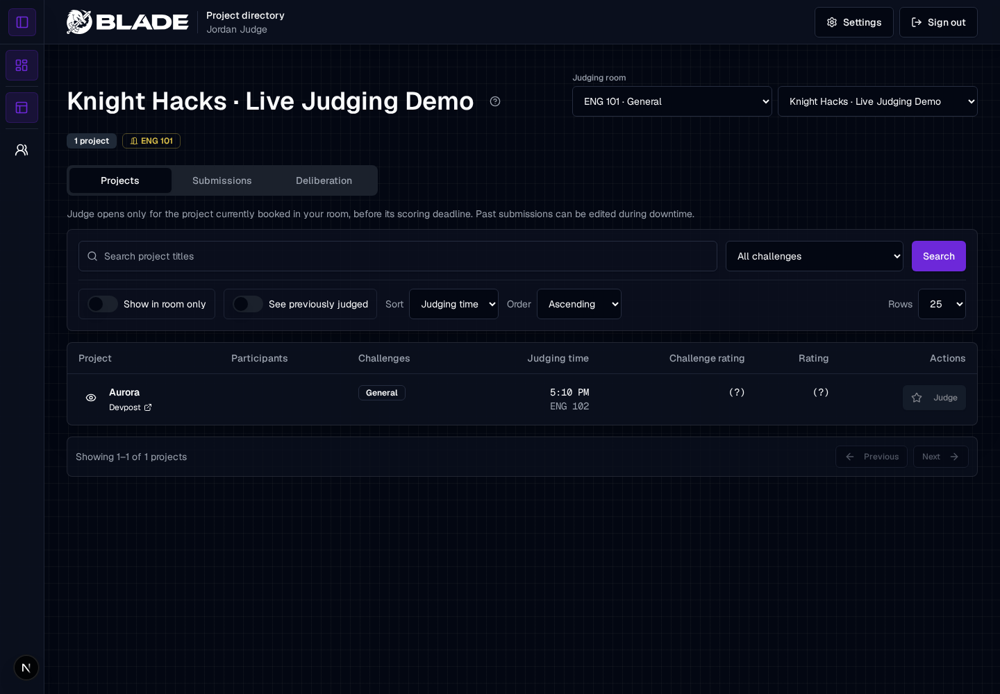

# Why

Judges could wait up to the next 30-second poll to see an organizer's announcement.
Blade now pushes a change notification when a judging transaction commits, then
refreshes the existing authorized views. The recorded local announcement appeared
in **0.973 seconds**, compared with **29.987 seconds** on main.

# What

Add a tRPC SSE subscription to the judge workspace and command center. PostgreSQL
LISTEN/NOTIFY carries invalidations between app processes. Announcements, room and
access changes, saved schedule changes, resets, and finalized scores publish
within their transactions.

The stream rechecks access, sends keepalives, and refetches on reconnect. Offline
page refreshes pause until networking returns. Existing queries retain their
room/guest filtering; polling remains for deadlines and recovery. Scope is Blade
and its API implementation.

Closes #574.

# Before and after

Organizer on the left; judge on the right. These are inline animations of the
reviewed browser recordings, at **normal speed**. The full polling wait and the
simulated network outage are shown. Startup footage was trimmed; the final
three-second result screenshot in each recording is explicitly labeled as a still.

**Before — main at `361d10a5`: the announcement waits for the next poll.**

**After — SSE: announcement, reassignment, and recovery from a network outage.**

| Action                                        |       Before |       After |
| --------------------------------------------- | -----------: | ----------: |
| Publish announcement → visible to judge       |     29.987 s | **0.973 s** |
| Save reassignment → new room visible          |      0.939 s | **0.864 s** |
| Restore network → missed announcement visible | Not recorded | **0.214 s** |

These are single local observations. The baseline reassignment happened just
before a poll, so it was already quick. Exact timings were measured from the
button click to visible text, independently of video clocks. The actual SSE
notification arrived 223 ms after Publish and 151 ms after Save; the visible
result includes the subsequent refetch and rendering.

Full-size result screenshots

Announcement visible in the judge's view:

Aurora reassigned to ENG 102:

Missed announcement received after restoring networking, without a page reload:

Recording setup and reproduction

Recorded September 16, 2026 in two independent Chromium sessions against a local
Next.js development server and disposable PostgreSQL database. People, projects,
and assignments are synthetic. Both versions use the same fixture and actions.
Discord was deliberately disconnected.

1. Create an active hackathon with judging open, a rubric, two staffed rooms, and
   a future Aurora appointment in ENG 101. Sign an officer and a judge into
   separate browser contexts.
2. Open the officer's Rooms tab and the judge's Projects page. Browse all rooms
   so Aurora stays visible after reassignment. Let the initial queries finish.
3. Publish “Judges: please check the updated room assignment for Aurora.” Measure
   from Publish to that text appearing in the judge's view.
4. Dismiss the banner, then reassign Aurora to ENG 102 from Schedule. Measure
   from Save to ENG 102 appearing in the judge's Aurora row.
5. Put the judge browser offline, replace the announcement in the officer
   browser, wait at least 20 seconds, and restore networking. The judge should
   receive the missed announcement without reloading.

The baseline opened no SSE connection. The after recording used native
EventSource with no substituted transport. The endpoint returned HTTP 200,
`text/event-stream`, `X-Accel-Buffering: no`, and an initial invalidation.
Original WebMs, MP4s, screenshots, and timestamps are retained in this PR's
feature bundle for provenance; the comparison above is self-contained.

# Test Plan

- Repository `pnpm format`, `pnpm lint`, and `pnpm typecheck`: passed.
- Initial focused tests: 25 API tests and 11 Blade tests passed.
- CI exposed two existing page tests that assumed the workspace was the outer
  React element. Reproduced both failures locally and updated them to render the
  page and inspect workspace props. The original hackathon-selection/read-only
  assertions remain; both tests also check the listener's hackathon scope.
- Full CI test command, `pnpm exec turbo run test --filter='!@forge/db'`,
  against a fresh PostgreSQL 16 container: **2,481 tests passed** across 351 files,
  including all 988 API tests and all 881 Blade tests. The database package has
  its own CI job, which passed on the initial PR run.
- Full monorepo production build: **21 tasks passed**, with no cached tasks.
  Ran `pnpm build --env-mode=loose` with temporary process values from
  `.env.example`, allowing those CI example values through Turbo. No environment
  files or build configuration were changed.
- Four changed/new React components/pages passed strict analysis.
- `pnpm analyze:react:changed` hits an existing parser error in the tRPC provider:
  `Cannot read properties of undefined (reading 'type')`. Reproduced on main at
  `361d10a5`; no check bypass was added.

Production proxy streaming and database connection mode still need verification;
the recordings use loopback HTTP. No deployment was run. Schedule solver progress
and private draft autosaves retain their existing refresh behavior.

## Checklist

- [x] Database: no schema changes.
- [x] Environment Variables: no environment variables changed.
