<!-- Draft PR title: [#581] Add the KHIX venue map and configurable room access -->
<!-- Suggested labels: Blade, Hack Sites, API, Database, Feature. Assign the contributor before opening a PR. -->

# Why

Hackers need a venue map that reflects the rooms officers have prepared for KHIX
and shows where activities are happening. Officers can now maintain that room
list in Blade and enable restrictions when it is ready.

# What

Closes: #581

- Add the KHIX campus and indoor venue map, floor navigation, room lookup, and
  event-to-room navigation. Activate HEC on campus with an explicit unavailable
  indoor-plan state until verified floor plans exist.
- Add a per-hackathon Blade room editor with building, room number, optional
  name, and a separate restriction toggle. Reuse Blade's shared Select and
  existing control styling.
- Show permitted rooms in gray, live activity in green, activity starting within
  60 minutes with a green outline, and restricted rooms in muted red without
  room labels. Known bathrooms remain blue; room lookup preserves access styling.
- Refresh room configuration through the scoped Hacker SDK. Initial failures
  offer Retry; failed refreshes retain the last configuration and show a retry
  overlay.
- Align the legend and event overlays with the existing interface. Put an
  accessible X inside the event card. Remove repeated room LIVE badges and
  circular campus event markers, retaining building activity counts and event
  navigation.
- Enable schedule visibility for confirmed participants as well as checked-in
  participants, with matching SDK capability hints and policy tests. Retain the
  existing gates for judging and other restricted dashboard features.
- Include the earlier dashboard shell and route-layout work supporting the map,
  keeping navigation and mobile scrolling coherent across dashboard pages.
- Add validated and audited configuration writes, participant-scoped reads,
  SDK contracts, and development-backup classification. Scope is Blade, KHIX,
  and the shared packages those apps require.

Database change: migration `0058_smart_roulette.sql` adds
`knight_hacks_hackathon_map_configuration`, keyed by hackathon with cascading
deletion, restrictions disabled by default, an empty room list, and an update
timestamp. The generated snapshot and journal entry are included. Apply the additive migration with the API/schema rollout before the new
frontends depend on it. This migration was regenerated after main added migrations 0055–0057; main’s migration history is preserved.

# Screenshots

Captured October 3, 2026 from the real local Blade and KHIX interfaces. Room names
and events below are clearly labeled local test fixtures. Restrictions were
temporarily enabled with BA1 145A, 145E, and 145D to show the different states;
the original saved configuration was restored and the disposable upcoming event
was removed afterward. External publishing and reminders were disabled for the
fixtures. The ordinary dev server was restored after the fault test.

Images are committed repository assets. The GitHub PR body links to the exact
branch commit so all 13 screenshots render directly in the draft. Empty screenshot padding was trimmed;
the mobile editor image is cropped to the relevant card.

## Blade room editor

Separate restriction toggle, three configured rooms, optional names, and Save:

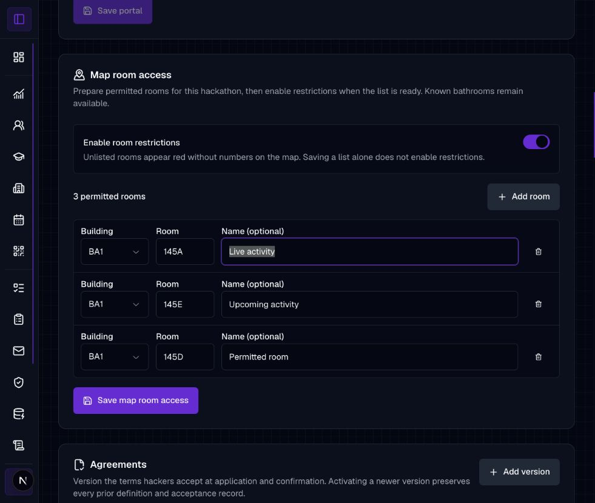

The shared building selector includes the supported venues, including HEC:

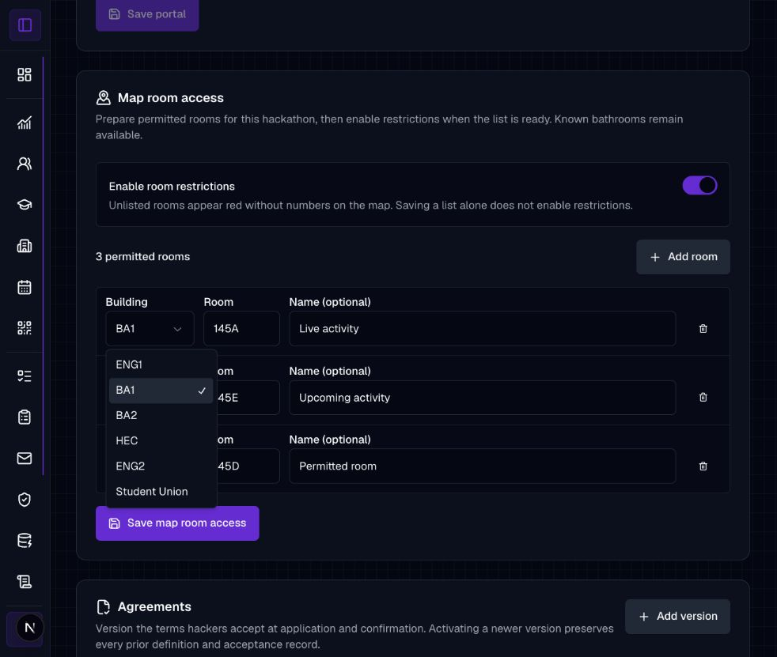

Mobile editor with stacked fields and an independently scrolling room list:

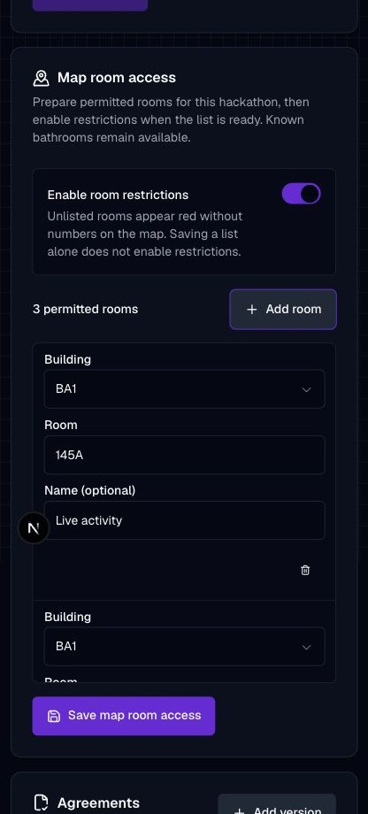

## Campus and HEC

Campus overview retains building activity counts without circular event markers:

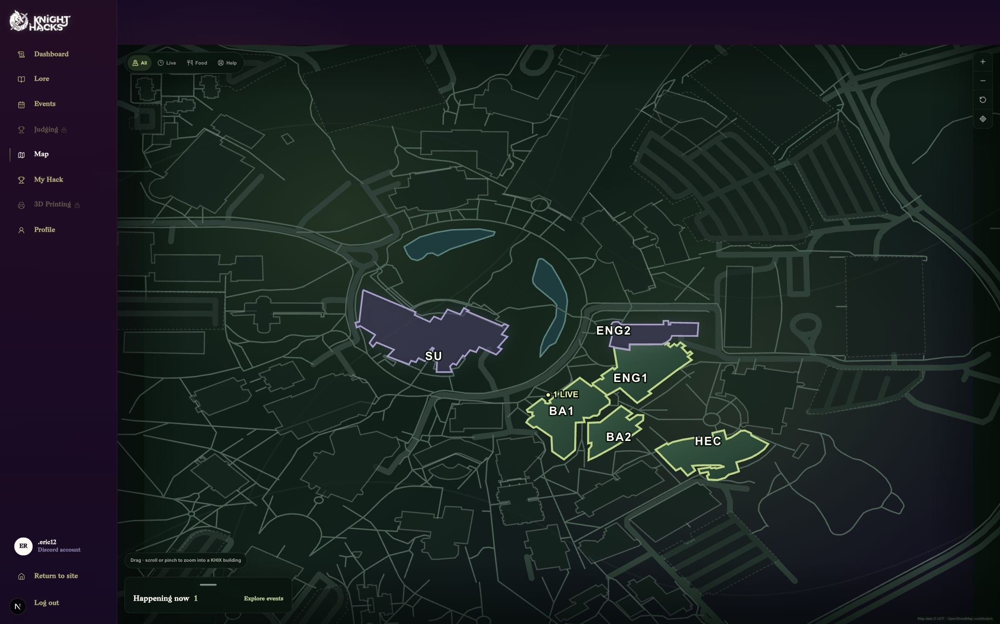

HEC focuses its campus footprint and reports that its indoor plan is unavailable:

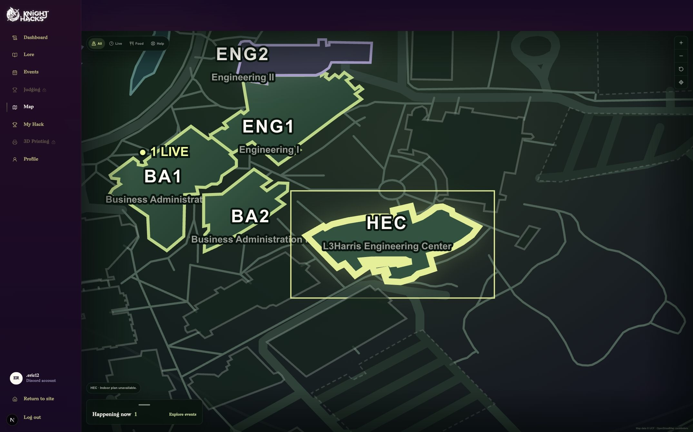

## Room states and legend

BA1 145A is live, 145E is upcoming, and 145D is permitted without activity.
Unlisted rooms are restricted and have no room labels. Live rooms have no
repeated LIVE badges:

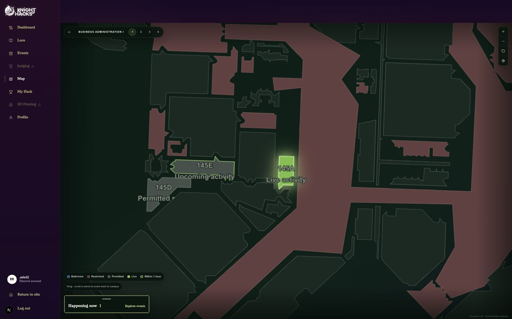

Mobile floor view with the legend wrapping inside the map:

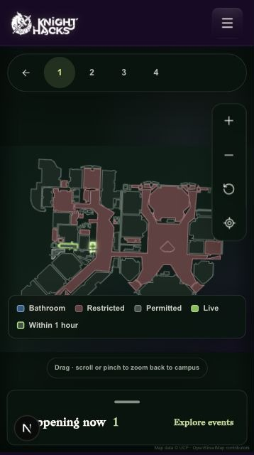

Known ENG2 bathrooms remain blue while restrictions are enabled:

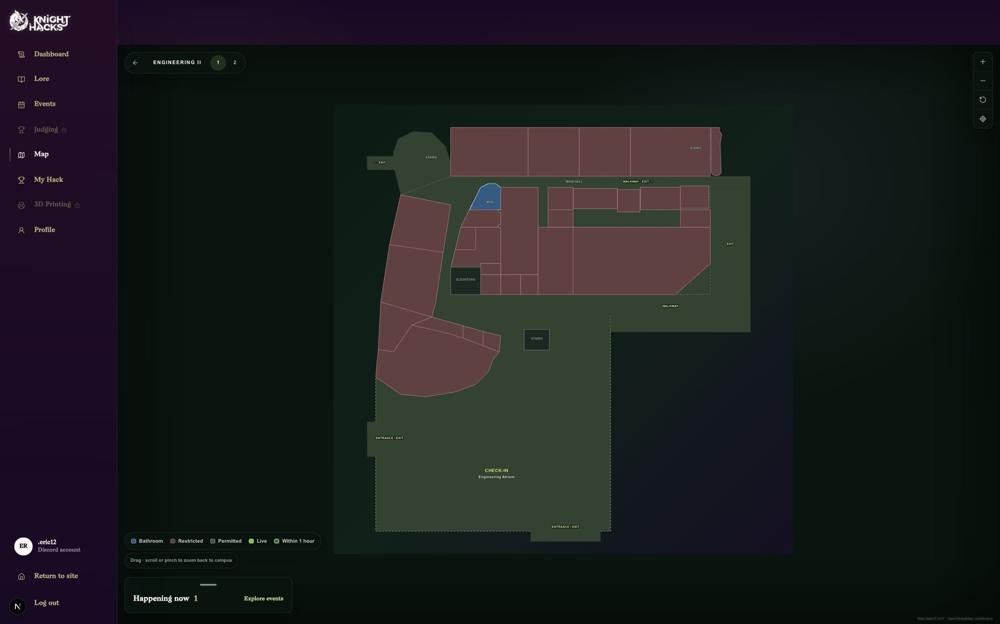

Looking up BA1 196 focuses the room and places the local test spot while retaining
its restricted appearance. This is a manually selected test spot, not GPS data:

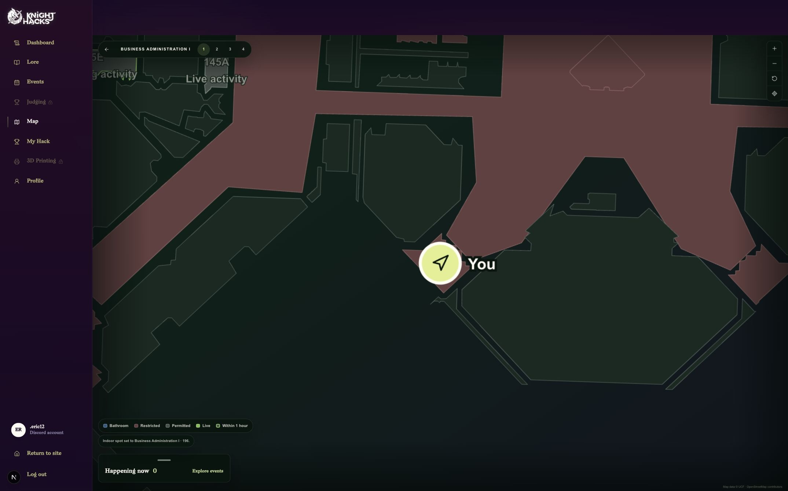

## Events

The events panel lists live and upcoming fixtures and provides room navigation:

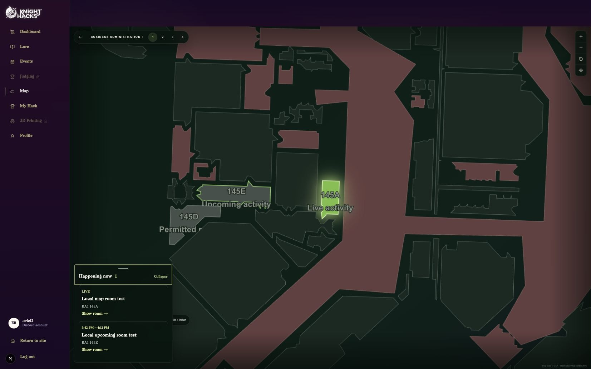

Desktop event card uses the portal typography and an in-card close control:

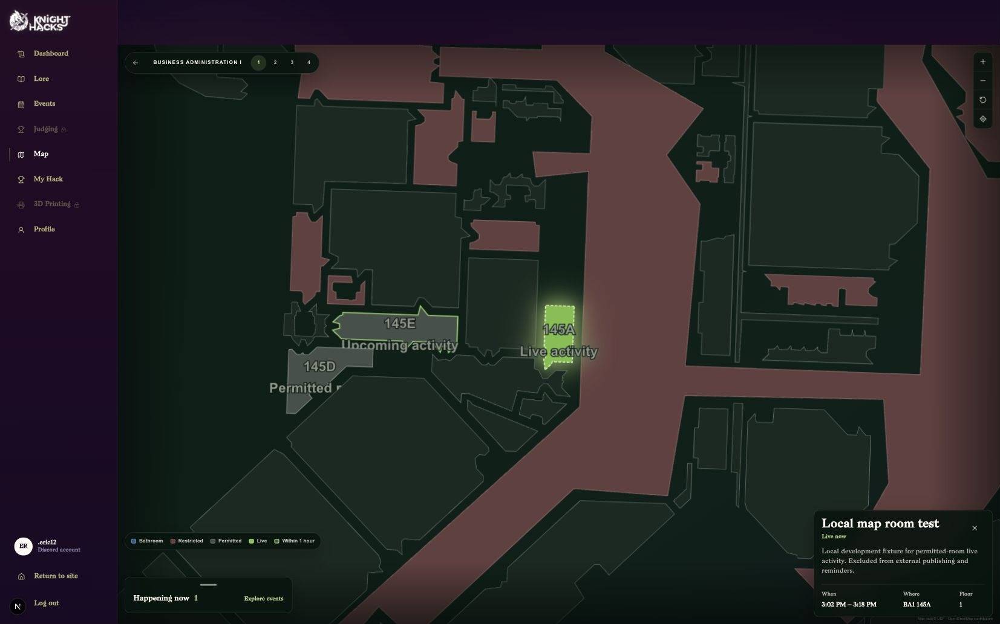

The same card on mobile, with readable metadata and the X inside the card:

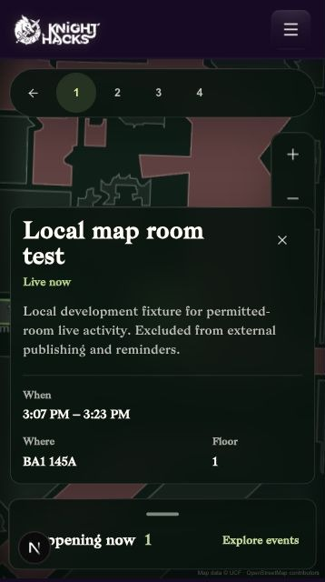

## Refresh failure

A temporary local proxy failed only the room-configuration request. The map
retained its saved restricted-room appearance and displayed the retry overlay:

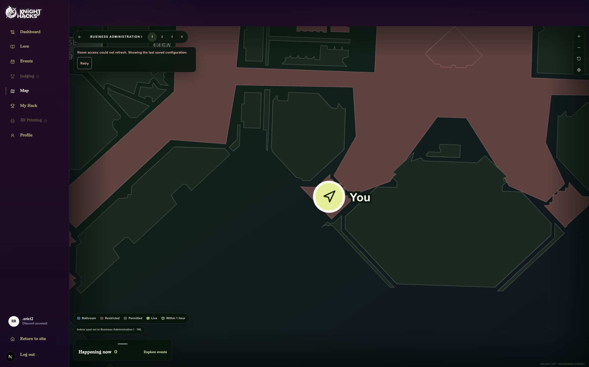

# Test Plan

Validation on the branch merged with main, October 4, 2026:

- Repository `pnpm format`, `pnpm lint`, and `pnpm typecheck`: passed. Lint
  retains warnings, with no errors.
- `pnpm analyze:react:changed`: passed, 29 files analyzed, zero failures.
- Full affected suites: **2,482 tests passed** — API 1,017; Blade 885; KHIX 57;
  validators 327; SDK 37; database 159.
- Disposable database tests passed for fresh installation, the additive map
  migration, defaults, persistence, participant scope, audit rollback, and
  cascading deletion. Migration lineage tests preserve main's history.
- `pnpm db:generate`: passed, producing `0058_smart_roulette.sql`, its snapshot,
  and the journal entry. No migration was applied to production.
- Blade and KHIX production builds: passed, including their shared dependencies.
- All 13 screenshot references resolve to readable images. Formatting and
  `git diff --check` passed. Earlier validation history is in [status.md](status.md).

Screenshots were captured October 3; the local upcoming test event and restored
configuration were verified again October 4. The separate mobile error/retry
capture remains pending and is not claimed as completed by these screenshots.

To reproduce: configure the three BA1 rooms in Blade, enable restrictions, create
local live/upcoming events in permitted rooms, then open the KHIX map with a
confirmed test application. Check the room states, floor navigation, event
navigation, HEC fallback, and responsive layouts. Fail the configuration request
after a successful load to inspect the retained policy and Retry overlay.

Verified HEC floor plans and additional bathroom classifications remain follow-up
work. Events do not automatically permit rooms; this feature controls map
presentation rather than physical access. No production deployment was performed.

## Checklist

- [x] Database: No schema changes, OR I ran `pnpm db:generate` and committed the generated files in `packages/db/drizzle/`
- [x] Environment Variables: No environment variables changed, OR I have contacted the Development Lead to modify them on Coolify BEFORE merging.

Local testing used an approved process-only portal-origin override;
no environment files or deployment settings changed.
